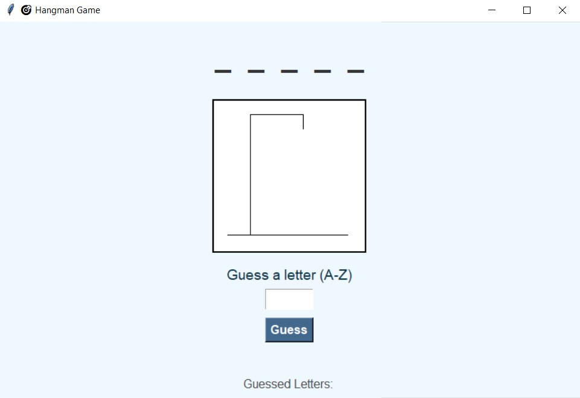

# CodeAlpha_Hangman-Game-
A classic word-guessing game developed using Python's tkinter library. The game randomly selects a word from a predefined list and displays it as blanks. The player guesses letters, and with each wrong guess, a visual "hangman" progresses. The player has a maximum of 6 incorrect attempts before the game ends.

Key Features:

Simple and interactive GUI using tkinter

Predefined word list

Tracks correct and incorrect guesses

Visual feedback for win/loss

Beginner-friendly design

Tech Stack: Python, Tkinter, Random, String

## 🎮 Hangman Game GUI Preview

